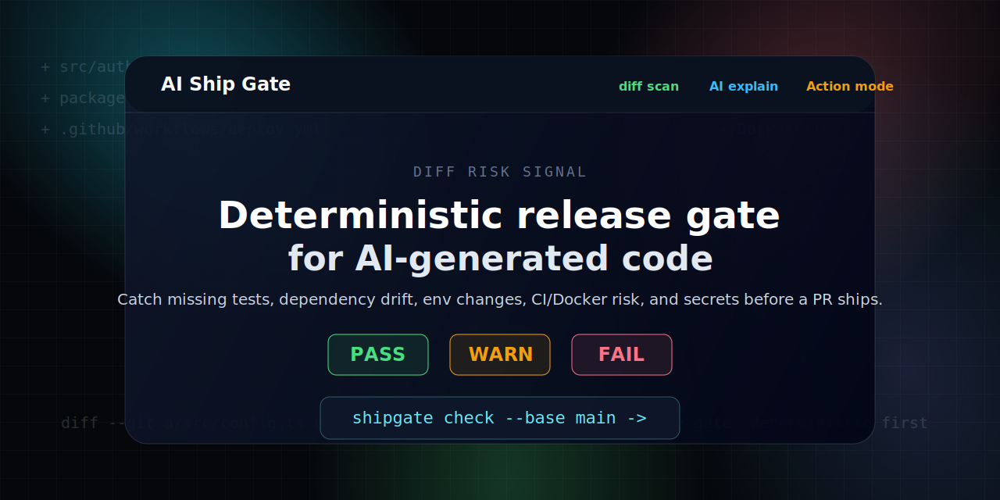

# AI Ship Gate

> A deterministic release gate for AI-generated code.

[](https://github.com/zixuanjiang332/ai-ship-gate/actions/workflows/ci.yml)
[](action.yml)
[](LICENSE)
[](docs/release.md)



AI coding makes changes fast. Shipping still needs a gate.

AI Ship Gate checks a PR-sized git diff for practical release risks: missing tests, dependency drift, unsafe env changes, CI and Docker changes, and secret-like values. Rules decide `PASS`, `WARN`, or `FAIL`; optional AI mode only explains the findings.

## Quickstart

Clone and run the current pre-v1 project locally:

```sh
git clone https://github.com/zixuanjiang332/ai-ship-gate.git
cd ai-ship-gate
npm ci
npm run build
node dist/cli.js check --base HEAD
```

After building locally, the CLI supports:

```sh
node dist/cli.js check --base main
node dist/cli.js check --format markdown
node dist/cli.js check --format json
node dist/cli.js check --ai
node dist/cli.js init
```

`node dist/cli.js init` writes `shipgate.config.yaml`. It fails if that file already exists, so existing configuration is not overwritten.

The npm package is not published yet. After npm publish, the planned zero-install path is `npx ai-ship-gate check`.

## Example Output

```md
# AI Ship Gate: FAIL

## Findings

### WARN: Source changed without tests

- Rule: `tests.missing-related-tests`
- Files: `src/auth.ts`
- Reason: Source-like files changed, but this diff does not include test-like files.
- Suggestion: Add or update tests that cover the changed behavior before shipping.

### FAIL: Secret-like value in diff

- Rule: `security.secret-in-diff`
- Files: `src/config.ts`
- Reason: The diff contains a token, key, password, or secret-like value.
- Suggestion: Remove the value from git history if needed, rotate it, and use a safe example value.
```

See [examples/risky-diff.md](examples/risky-diff.md) for a compact PR scenario that triggers multiple rules.

## Verdicts

| Verdict | Meaning | Default CI behavior |
| --- | --- | --- |
| PASS | No warn or fail findings. | Exit 0 |
| WARN | Risk found. | Exit 0, does not block PRs by default |
| FAIL | High-risk issue found. | Exit 1 |

Set `failOn: warn` to make WARN verdicts exit 1 too.

## Rules

| Area | What it looks for | Example finding |
| --- | --- | --- |
| Test risk | Source-like changes without related test changes. | `tests.missing-related-tests` |
| Dependency risk | Manifest changes without matching lockfile updates, risky install scripts. | `dependencies.lockfile-not-updated` |
| Env risk | New env vars without examples, secret-like env values. | `env.example-not-updated` |
| CI/deploy/Docker risk | Deploy workflow changes and Dockerfiles without healthchecks. | `deploy.workflow-changed` |
| Security risk | Token, key, password, or secret-like values in the diff. | `security.secret-in-diff` |

## GitHub Action

In CI, prefer `origin/main` as the base ref after `actions/checkout`; local CLI runs commonly use `main`.

```yaml
name: AI Ship Gate

on:
  pull_request:

jobs:
  shipgate:
    runs-on: ubuntu-latest
    steps:
      - uses: actions/checkout@v4
        with:
          fetch-depth: 0
      - uses: zixuanjiang332/ai-ship-gate@main
        with:
          base: origin/main
          ai: false
```

`@main` is suitable for pre-v1 testing. Switch to `@v1` after the first stable release tag exists. See [docs/release.md](docs/release.md).

## Configuration

Create `shipgate.config.yaml` with `node dist/cli.js init`, or write one directly:

```yaml
failOn: fail
ai:
  enabled: false
checks:
  tests: true
  dependencies: true
  env: true
  ci: true
  docker: true
  security: true
```

## Optional AI Mode

```sh
OPENAI_API_KEY=... node dist/cli.js check --ai
```

AI mode reads deterministic findings and writes an explanation. It does not decide the verdict.

Environment variables:

| Variable | Purpose |
| --- | --- |
| `OPENAI_API_KEY` | Enables optional AI explanations. |
| `OPENAI_BASE_URL` | Overrides the OpenAI-compatible API base URL. |
| `OPENAI_MODEL` | Overrides the explanation model. |
| `SHIPGATE_AI_TIMEOUT_MS` | Bounds optional AI provider latency. |

## FAQ

### Does AI decide whether my PR passes?

No. Deterministic rules decide `PASS`, `WARN`, or `FAIL`. AI mode only explains those findings.

### Does this replace tests or code review?

No. It is a release gate for common risks in AI-generated diffs. It helps reviewers notice risky changes earlier.

### Why does GitHub show a Marketplace banner?

This repository contains `action.yml`, so GitHub recognizes it as an Action. Marketplace publishing is optional and should wait until a `v1` tag exists. See [docs/marketplace.md](docs/marketplace.md).

### Why use `fetch-depth: 0` in the Action example?

AI Ship Gate compares git refs. Full history makes base refs such as `origin/main` available in CI.

## Roadmap

- [ ] Publish `ai-ship-gate` to npm.
- [ ] Create a stable `v1` GitHub Action tag.
- [ ] Draft GitHub Marketplace listing.
- [ ] Add more language-aware risk heuristics.
- [ ] Add optional machine-readable annotations without changing deterministic verdicts.

## Release Status

AI Ship Gate is currently pre-v1. The CLI and Action are implemented and tested in this repository, but npm publish, `v1` tag creation, and Marketplace publishing are separate release steps.

See [docs/release.md](docs/release.md) for the release checklist.
